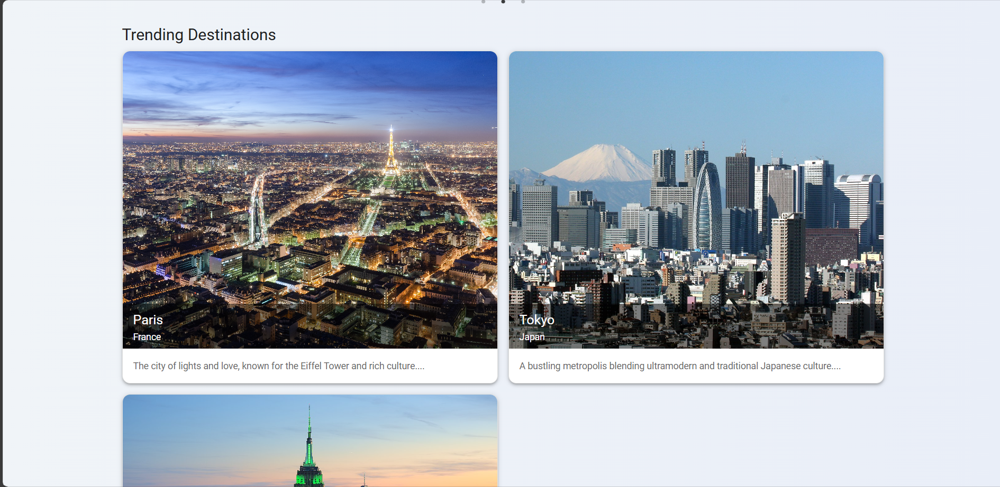
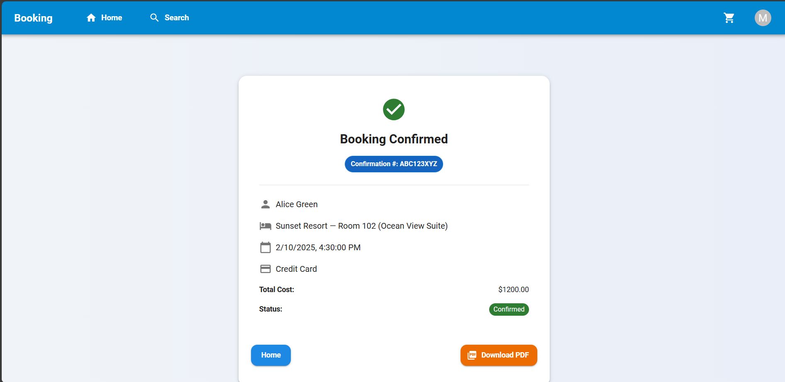
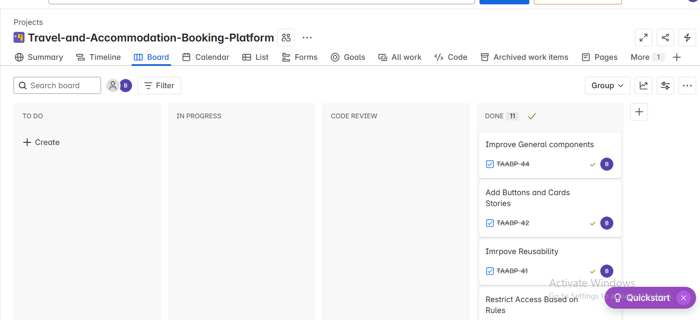

# Booking Project

A modern React-based booking application built with TypeScript, leveraging a range of libraries and tools for UI components, state management, routing, forms, API data fetching, and more.

---

## Table of Contents

- [Overview](#overview)  
- [Technologies & Dependencies](#technologies--dependencies)
- [Demo](#demo)
- [Login Information](#login-information)  
- [Public Pages](#public-pages)  
- [User Pages](#user-pages)  
- [Admin Pages](#admin-pages)
- [Starting point](#starting-point)
- [Project Scrum Board](#project-scrum-board) 
- [Scripts](#scripts)  
- [Getting Started](#getting-started)  
- [Contact](#contact)  
- [Acknowledgement](#acknowledgement)  

---

## Overview

This project is a private React app using the latest tools to provide a scalable, performant, and developer-friendly environment. It utilizes:

- React 19 with functional components and hooks
- Material UI (MUI) for UI components and icons
- Redux Toolkit for state management and redux-persist for persistence
- React Query for API data fetching and caching
- Formik & Yup for form handling and validation
- Leaflet and React Leaflet for interactive maps
- JWT for authentication token decoding
- Axios for HTTP requests
- React Router DOM for routing
- Other utilities like Day.js for date management, js-cookie for cookie handling, and more

---

## Technologies & Dependencies

- **TypeScript**  
  Typed superset of JavaScript for safer coding.  
- **Vite**  
  Next-generation frontend tooling for fast development.  
- **ESLint & Plugins**  
  Linting with React hooks and refresh support to maintain code quality.  
- **@types/** packages  
  TypeScript typings for various libraries.

---

---
## Demo

Check out the demo video here: https://drive.google.com/file/d/17ehfZ9yevD4HRP0K86Pt6cOxFN4A-GMA/view?usp=sharing

---

---
## Login Information

### User Login
- **Username:** `user`
- **Password:** `user`

### Admin Login
- **Username:** `admin`
- **Password:** `admin`
---

## Public Pages

### Login Page  
  

### Unauthenticated Access Page  
  

### Access Denied Page  


### Not Found Page


### Failed to Load Page


---

## User Pages

### Home Page Screenshots  
  
  
  
  

### Search Page  


### Hotel Details  
  


### Checkout Pages  
  


### Booking Confirmation  
  


### User Profile  


---

## Admin Pages

### Cities Management  
  

#### Add/Edit City Dialog  


### Hotels Management  


#### Add/Edit Hotel Dialog  


### Delete Confirmation Dialog  


### Hotel Rooms Management  


#### Add/Edit Hotel Room Dialog  


---

---
## Starting point

I followed this UX: https://excalidraw.com/

---

---
## Project Scrum Board

My project is managed using an agile scrum board to track tasks and sprints.


---

## Scripts

| Command           | Description                              |
| ----------------- | -------------------------------------- |
| `npm run dev`     | Start development server with hot reload |
| `npm run build`   | Compile TypeScript and build production files |
| `npm run lint`    | Run ESLint to check code style and errors |
| `npm run preview` | Preview the production build locally   |

---

## Getting Started

1. **Clone the Frontend Repository:**  
   ```bash
   git clone https://github.com/BaselTurkman/Travel-and-Accommodation-Booking-Platform
   cd Travel-and-Accommodation-Booking-Platform     

2. **Install Frontend Dependencies:**  
   ```bash
   npm install
   
3. **Run the Frontend Development Server:**  
   ```bash
   npm run dev

4. **Clone the Backend Static Repository:**
     Make sure to clone this repository: https://github.com/BaselTurkman/Travel-and-Accommodation-Booking-static-BE.git
   Then follow its *Getting Started* instructions to run the backend server and enable API data fetching.
   
5. **Configure the API URL:**
     Ensure your `.env` file contains the following so the frontend can connect to the backend:
   ```bash
   VITE_API_URL="http://localhost:5000/api/"

---

## Contact

If you have any questions, feedback, or would like to get in touch, feel free to reach out:

- **Name:** Basel Turkman  
- **Email:** Basel.Turkman123@gmail.com 
- **GitHub:** [https://github.com/BaselTurkman](https://github.com/BaselTurkman)  
- **LinkedIn:** [https://linkedin.com/in/baselturkman](https://www.linkedin.com/in/basel-turkman/)

Looking forward to connecting with you!

---

## Acknowledgement 

I extend my heartfelt thanks to <b> Foothill Technology Solutions </b> for offering me the opportunity to participate in this internship cycle. Their consistent support has been crucial in the development of this project.
